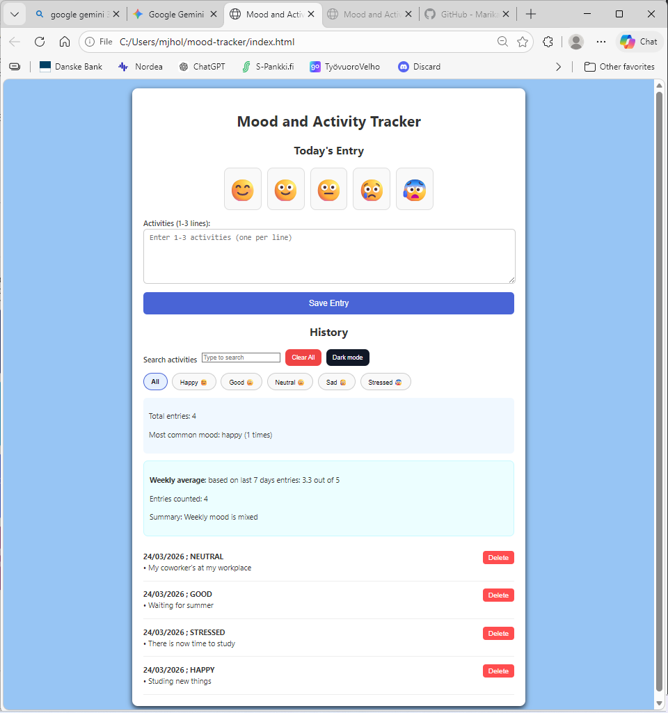
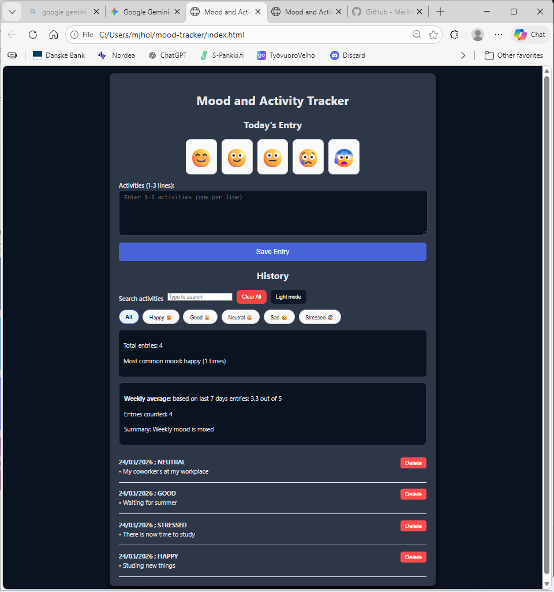

# Mood & Activity Tracker

A clean, single-page mood and activity tracker built with **vanilla HTML, CSS, and JavaScript**. This project was developed as part of the Web Applications course at **Laurea University of Applied Sciences**.

**Live Demo:** (https://marikahollmen.github.io/Mood-tracker/) 

**Repository:** https://github.com/MarikaHollmen/Mood-tracker.git

## Features

* **Mood Selection:** Choose from five distinct moods (Happy, Good, Neutral, Sad, Stressed) using interactive buttons.
* **Activity Logging:** Log 1–3 daily activities or highlights in a simple text format.
* **Data Persistence:** All entries are saved to the browser's **localStorage**, ensuring data stays safe even after a page refresh.
* **History & Filtering:** Browse your past entries and filter them by specific moods to see patterns.
* **Real-time Search:** Instantly find specific entries by typing keywords in the search bar.
* **Smart Statistics:** View the total number of entries and your most frequent mood at a glance.
* **Weekly Average:** A dynamic calculator that analyzes the last 7 days of entries, provides a score from **1–5**, and gives a written summary.
* **Dark Mode:** A toggleable dark theme that remembers the user's preference.
* **Data Management:** Delete individual entries or **clear the entire history** with a confirmation prompt.

## How to Run

### Windows & macOS
1.  Download the project files (`index.html`, `style.css`, `script.js`) into the same folder.
2.  Open `index.html` directly in any modern web browser.
3.  **For Developers:** It is recommended to use the **Live Server** extension in VS Code.

## Architecture

The project follows a simple separation of concerns:
* **index.html** – Semantic structure and accessibility (ARIA labels).
* **style.css** – Responsive layout, custom colors, and `.dark` class for theming.
* **script.js** – App logic, event listeners, and **localStorage** management.

---

## Reflection

Building this Mood & Activity Tracker taught me a lot about the power of vanilla JavaScript. One of the **most challenging parts** of the entire process wasn't actually the coding itself, but managing the development environment. I struggled significantly with getting **GitHub and VS Code** to work together because I had multiple accounts. After some trial and error, I had to close my extra accounts and start fresh with a single one to get the synchronization working correctly.

As for the development, writing the core logic was relatively straightforward, but **GitHub Copilot** proved to be an invaluable assistant for debugging. It was excellent at spotting small errors and providing clear guidance when I ran into logic problems. Copilot also helped me understand how to structure certain functions more efficiently.

I also spent time fine-tuning the user interface to make it more personal. I made several **CSS adjustments**, such as:
* Changing the **color scheme** to be more visually appealing.
* Modifying the **textarea size** to better fit the input needs.
* **Centering the headings** to create a more balanced layout.

## Self-Assessment

| Criterion | Score | Evidence |
| :--- | :--- | :--- |
| **Core Functionality** | 5/5 | Save, history, filter, search, and stats work perfectly. |
| **Code Quality** | 4/5 | Organized functions and clean, readable code. |
| **UX & Accessibility** | 4/5 | Responsive layout, Dark Mode, and centered UI elements. |
| **Data Handling** | 5/5 | Reliable localStorage use and data validation. |
| **Documentation** | 5/5 | Complete README with reflection and run instructions. |

---
## Screenshots

### Light Mode

### Dark Mode

